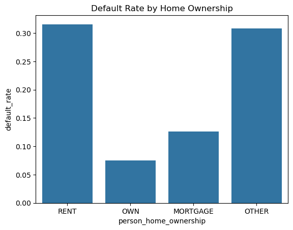
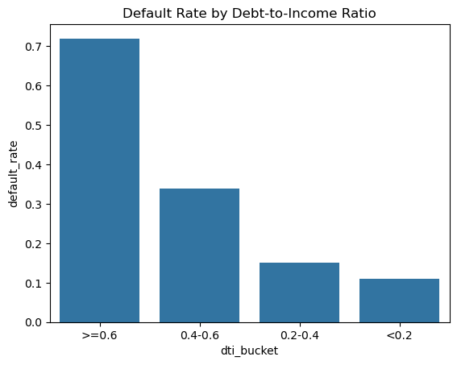
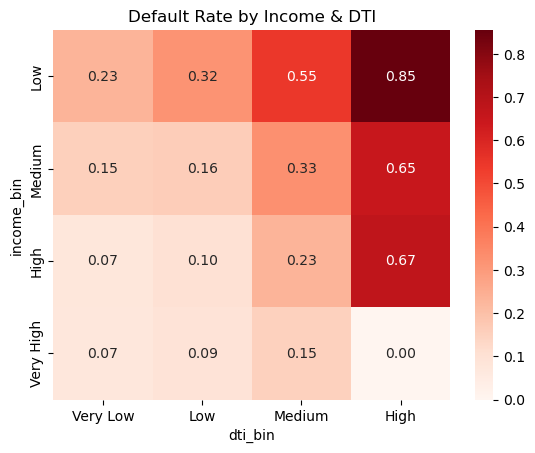
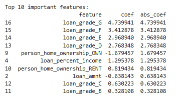
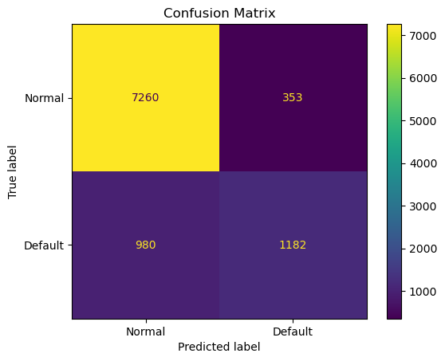

# Credit Risk Analysis – 信贷违约风险分析

## 项目简介
使用 Kaggle 公开信贷数据，通过 SQL + Python 完成风控特征分析、规则挖掘与逻辑回归建模。

## 数据集
- 来源：[Kaggle Credit Risk Dataset](https://www.kaggle.com/datasets/alexdister/credit-risk-dataset)
- 记录数：约 3.2 万条，29 个特征
- 目标变量：`loan_status`（1=违约，0=正常）

## 技术栈
- MySQL（数据存储与查询）
- Python（pandas, matplotlib, seaborn, scikit-learn）
- Jupyter Notebook

## 分析结果摘要
- 整体违约率：21.82%
- 高负债（DTI ≥ 0.6）违约率：85.5%
- 组合规则（租房 + 低等级 D~G + 历史违约）违约率：**75.07%**
- 逻辑回归模型 AUC = **0.8624**，准确率 86.36%
- 最重要的风险特征：`loan_grade_G`（+4.74），`loan_grade_F`（+3.41），自有房（-1.68）

## 图表展示






## 项目结构
```text
credit-risk-analysis/
├── credit_risk_analysis.ipynb
├── README.md
├── requirements.txt
├── .gitignore
└── images/
    ├── default_rate_by_home_ownership.png
    ├── default_rate_by_dti.png
    ├── heatmap_income_dti.png
    ├── top10_features.png
    └── confusion_matrix.png

## 作者
- GitHub：syfzln(https://github.com/syfzln/credit-risk-analysis)

## 许可证
本项目仅用于学习，数据集遵循 CC0 公共领域许可。
